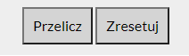

# Currency converter

I've decided to start an online course to become a Web Developer, and this is my first project in which I am practicing the basics of **JavaScript**. I am still playing with it as I gather more knowledge about JS. 

Clean code and using the simplest methods is what I am aiming at here. There is a **long way** ahead of me, and I am aware of it. 

## Demo

https://arturpajak.github.io/Currency-converter/

### Walkthrough

**The First form is for converting from PLN to another currency.**
- In the first input, the user types in the amount of money that he/she wants to convert.

- The second input is for choosing the currency that the user wants to choose
 1. The first option from the drop-down menu lets the user type the exchange rate himself (in the second input).
 1. The second to third options are for the user to choose from 3 predefined currencies (USD, EUR, GBP).
 1. If the user chooses one of the predefined options, he won't be able to change the exchange rate.
 1. If the user inputs the exchange rate himself, the result will display a text: 'in the currency chosen by you' - after the calculated result.
 1. If the user chooses a predefined currency, it simply displays USD, EUR or GBP after the calculated result.
 

**The second form is for converting from any currency to PLN**
- It works similar to the first form but closed in one div(i added this form later on and wanted to change at least that).
- The first and second inputs work pretty much the same as in the first form.
- After the resulting amount, it shows PLN.

**Buttons**
- The first one is for calculating (submit button with .preventDefault)
- The second button is for resetting the corresponding form

There is also a message that says from where I got the exchange rates, there is also a link to that website.

#### Checklist

- [ ] Put the first form into one div
- [ ] Add a background image
- [ ] Use function in Java Script, wherever I can 
